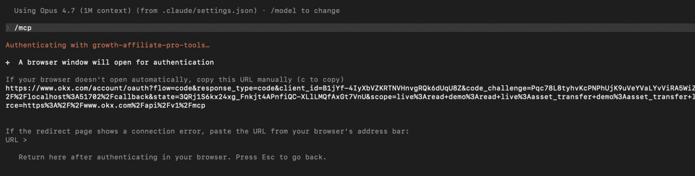
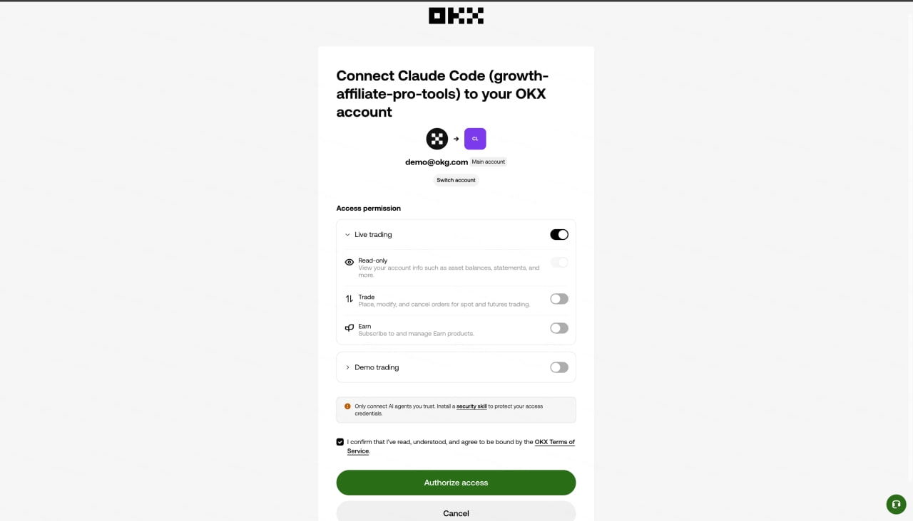
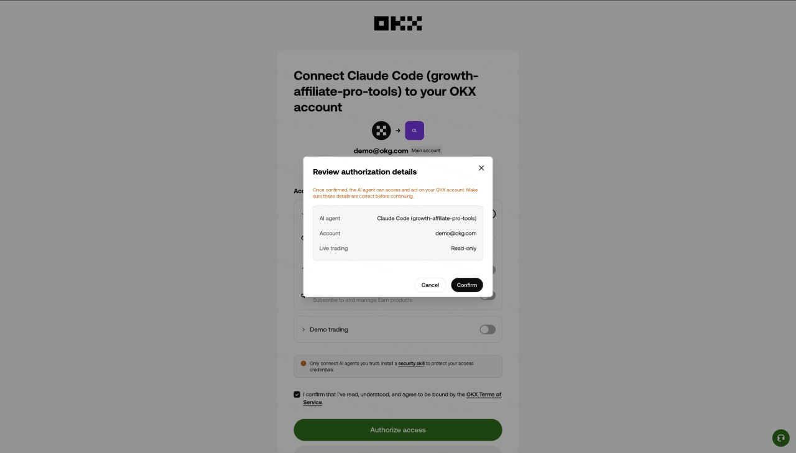
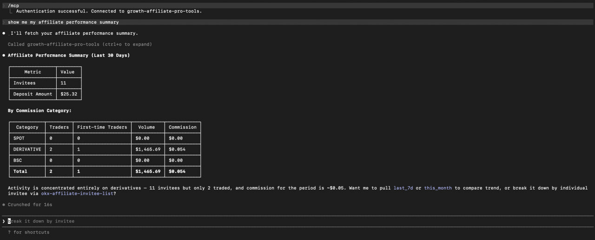

# Install on Claude Code

[← Back to install index](../../README.md#quick-start)

Claude Code (`claude` CLI) is the recommended client. It has native MCP OAuth and the install
is a single command.

## Prerequisites

- [Claude Code CLI](https://docs.anthropic.com/en/docs/claude-code) installed (`claude --version`)
- An OKX account that is enrolled as an **Affiliate**

## Method 1 — CLI command (recommended)

Run this in any terminal:

```bash
claude mcp add --transport http growth-affiliate-pro-tools \
  https://www.okx.com/api/v1/mcp/growth-affiliate-mcp
```

Done. Skip ahead to **[Authentication](#authentication)**.

## Method 2 — Project-scoped `.mcp.json`

Add the entry to `.mcp.json` in your project root (create the file if it does not exist):

```json
{
  "mcpServers": {
    "growth-affiliate-pro-tools": {
      "type": "http",
      "url": "https://www.okx.com/api/v1/mcp/growth-affiliate-mcp"
    }
  }
}
```

If `.mcp.json` already lists other MCP servers, just add the `growth-affiliate-pro-tools` key
under `mcpServers`.

Project-level `.mcp.json` is checked into the repo so your whole team gets the same MCP setup
on clone.

## Method 3 — Global `settings.json`

Edit `~/.claude/settings.json`, add to `mcpServers`:

```json
{
  "mcpServers": {
    "growth-affiliate-pro-tools": {
      "type": "http",
      "url": "https://www.okx.com/api/v1/mcp/growth-affiliate-mcp"
    }
  }
}
```

This applies to **every** project. Use it if you want the MCP available everywhere without
per-project setup.

> 💡 Project-level `.mcp.json` takes precedence over global `settings.json`. Use project-level
> for team sharing, global for personal convenience.

## Configuration reference

| Field   | Value                                                   | Notes                       |
| ------- | ------------------------------------------------------- | --------------------------- |
| `type`  | `http`                                                  | Streamable HTTP transport   |
| `url`   | `https://www.okx.com/api/v1/mcp/growth-affiliate-mcp`   | OKX-hosted endpoint         |

## Authentication

After registering the MCP, you authenticate **once** — Claude Code stores the token and
refreshes it automatically.

### Step 1 — Run `/mcp` inside Claude Code

```
/mcp
```

You will see Claude Code begin the OAuth handshake:



A browser window opens automatically. If it does not, copy the URL printed in the terminal
and open it manually. Sign in with the OKX account that is enrolled as an Affiliate —
credentials from a different account will succeed at OAuth but every tool call will then
return empty data.

### Step 2 — Grant the Live Trading → Read scope

On the consent screen:

- ✅ Toggle **Live trading** ON
- ✅ Read-only is on by default — leave it on
- ❌ **Do NOT enable** Trade, Earn, or Demo trading



Read-only is the only scope this MCP needs. Granting more is unnecessary and increases the
blast radius if your token leaks.

Tick *I confirm…* and click **Authorize access**.

### Step 3 — Review and confirm

OKX shows a final review with the AI agent name, your account, and the requested scope:



Confirm the row reads `Live trading — Read-only` and click **Confirm**.

### Step 4 — Verify success

Back in your Claude Code terminal:



You should see `Authentication successful. Connected to growth-affiliate-pro-tools.`, then
you can immediately call tools like `okx-affiliate-performance-summary` in natural language.

## Smoke-test the install

Ask Claude Code:

> *Show me my affiliate performance.*

It should call `okx-affiliate-performance-summary` and return numbers. If it does, you are
done.

## Troubleshooting

| Symptom                                                          | Fix                                                                                     |
| ---------------------------------------------------------------- | --------------------------------------------------------------------------------------- |
| `claude mcp add` fails with "unknown command"                    | Update Claude Code: `npm i -g @anthropic-ai/claude-code` (or your package manager)      |
| Browser does not open                                            | Copy the URL Claude Code prints and open it manually                                    |
| `Authentication failed` in terminal                              | Make sure your OKX account is an Affiliate; check you did not block third-party cookies |
| 401 on tool calls hours later                                    | Token expired (≈ 1 h). Re-run `/mcp` once or just retry the tool call                   |
| `500 system error` from `okx-affiliate-invitee-list`             | The `limit` parameter was ≥ 99. Cap it at `"95"`                                       |

For more, see [`docs/faq.md`](../faq.md).

## Removing the MCP

```bash
claude mcp remove growth-affiliate-pro-tools
```

Or delete the entry from `.mcp.json` / `~/.claude/settings.json`. To revoke OAuth access, sign
in to OKX → *Connected apps* and remove the entry there.
