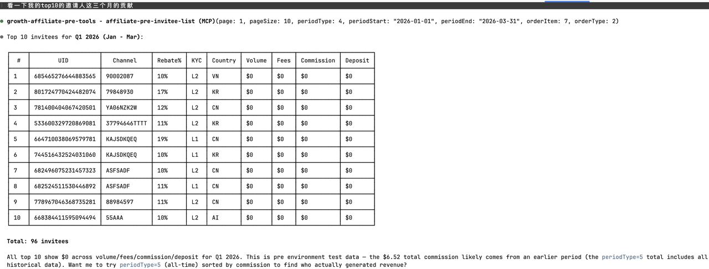
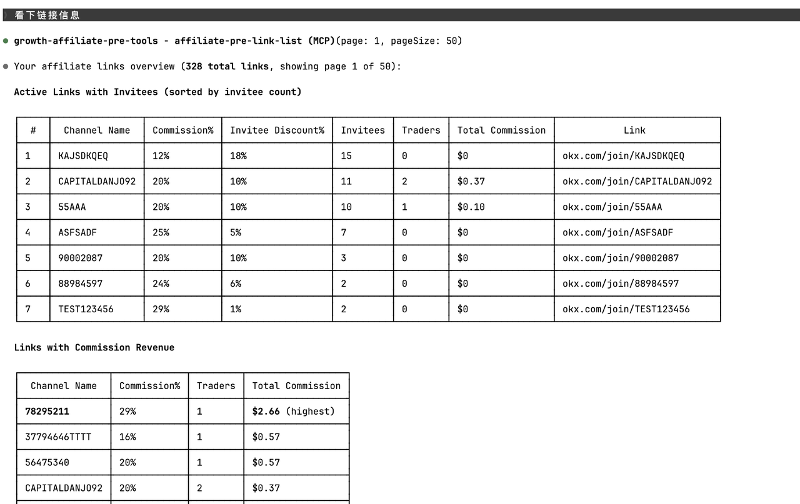

# Usage examples

After OAuth, you talk to the MCP through your agent in **natural language**. The agent picks
the right tool — there are no command-line incantations to memorize.

## Performance & summaries

> *"Show me my affiliate performance for the last 30 days."*
> *"How am I doing this month vs last month?"*
> *"Total commission and volume for Q1 2026?"*

The agent calls `okx-affiliate-performance-summary` with the matching `periodType`
(`last_30d`, `this_month`, `last_month`) — or with `begin` + `end` Unix-ms timestamps for
custom ranges like Q1.

## Invitee analysis

> *"List my top 10 invitees by commission this quarter."*
> *"Show invitees who joined this week."*
> *"Who are my top derivatives traders?"*
> *"Find invitees from Vietnam (KYC country VN)."*

These all hit `okx-affiliate-invitee-list` with different `orderBy` and filter parameters
(`commissionCategory: DERIVATIVE`, `kycStatus: verified`, etc.).

> ℹ️ The schema no longer has `hasDeposit` / `hasTrade` / `countryCode` filters that earlier
> versions exposed. To find "deposited but never traded" or country-specific cohorts, the
> agent will pull a list and filter client-side.

## Single user deep dive

> *"Pull up details for UID 743072917935893796."*
> *"What's user XYZ's lifetime trading volume and current month activity?"*
> *"How much has UID ABC withdrawn vs deposited?"*

→ `okx-affiliate-invitee-detail` returns lifetime totals plus `volMonth` (current
calendar-month volume — useful for spotting users who slowed down recently).

## Links and channels

> *"List all my invite links sorted by trader count."*
> *"Which co-inviter links did I get added to?"*
> *"What's my best link by 24-hour commission?"*

→ `okx-affiliate-link-list`. The `commission24h` field surfaces hot channels.

## Sub-affiliate network (MLRS)

> *"How are my sub-affiliates doing? Show top 10 by commission."*
> *"Look up sub-affiliate UID 123456789's stats."*

→ `okx-affiliate-sub-affiliate-list`. The new schema is **lifetime-only** (no period
filtering on this tool); for time-windowed sub-affiliate analysis use
`okx-affiliate-invitee-list` with `subAffiliateUid` instead.

## Co-inviter relationships

> *"Show channels where I'm a co-inviter."*

→ `okx-affiliate-co-inviter-list`

## Multi-tool prompts

You can chain multiple tools in a single prompt — the agent will call them sequentially:

> *"Give me my last-30-days summary, then list the top 5 invitees by commission for the
> same period."*

The agent calls `okx-affiliate-performance-summary` (`periodType: last_30d`) and then
`okx-affiliate-invitee-list` (`periodType: last_30d`, `orderBy: rebate`, `orderDir: desc`,
`limit: 5`), then summarizes.

## Tips for getting good answers

- **Be specific about time windows.** "Recently" is ambiguous — "last 7 days" or
  "March 2026" routes to the right `periodType`.
- **Specify sort order** when you want the top N. "Top by commission" vs "top by volume"
  changes which `orderBy` the agent uses.
- **Iterate.** If a first answer is too coarse, follow up with "drill into the top entry" —
  the agent will switch from list to detail.
- **Ask for breakdowns** explicitly. "By category" tells the agent to either filter
  (`commissionCategory: SPOT`) or surface the per-category breakdown from the
  `details[]` array.
